# GenAI應用技術演進史

## 探索GenAI應用技術演進

從早期的大型語言模型到現代的多代理系統，見證生成式人工智慧技術的革命性發展歷程。每一項技術都試圖解決前一代的問題，推動著AI向更智能、更實用的方向發展。

    - GPT-3
    - Early LLMs
    - Prompt Engineering
    - Retrieval Augmented Generation (RAG)
    - In-Context Learning
    - Fine Tuning
    - Function Calling
    - Agent
    - Agentic RAG
    - Model Context Protocol (MCP)
    - Multi-Agent System
    - AI‑Assisted Software Development
    - Vibe Coding
    - Vibe Spec
    - Multimodal AI
    - Synthetic Media
    - Generative Design
    - Causal AI

---

## GPT-3/3.5

### 時間：2020.06~2022.11

OpenAI 於 2020 年 6 月 發佈 GPT-3，標誌著大型語言模型（LLM）的重要進展。1750億參數展現前所未有的語言理解和生成能力。

OpenAI於 2022 年 推出 GPT‑3.5，包括 text-davinci-002/003 及 gpt-3.5‑turbo，其中 ChatGPT 正是基於 GPT‑3.5 的 fine‑tuned 版本（即 InstructGPT 系列）。

ChatGPT於 2022 年 11 月推出，僅 5 天即突破 100 萬用戶，2 個月內達到 1 億用戶，顯著改變全球對 AI 的認知與採用節奏 。

### GPT 系列模型發布時間表

| 發佈時間 | 模型  | 參數 |
| -------- | ----- | ---- |
| 2018 | GPT-1 發佈 | 1.17 億個參數 |
| 2019 | GPT-2 發佈 | 最大 15 億個參數 |
| 2020 | GPT-3 發佈 | 1750 億個參數 |
| 2022-11-30 | GPT-3.5 發佈 | 驅動 ChatGPT |
| 2023-03 | GPT-4 發佈 | 提升推理能力與穩定性 |
| 2023-11 | GPT-4 Turbo | 效能/成本優化，context 最長 128K |
| 2024-05 | GPT-4o 發佈 | 多模態整合 : 圖像、語音、影片 |

---

## 早期大語言模型 Early Large Language Models

### 時間：~2022

早期的 LLM（如 GPT-2, GPT-3）能夠生成類似人類的自然語言文本，但存在幾個主要問題：

    - 知識受訓練數據限制：它們只能回答基於訓練數據的問題，無法即時更新知識。
    - 幻覺（Hallucination）問題：經常生成錯誤或不存在的資訊。
    - 缺乏行動能力：它們只能提供文本回應，不能與外部系統互動。

### 流程：
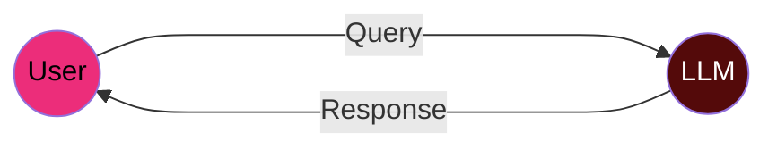
在早期 LLM 應用中，用戶與模型之間的交互是單向且靜態的：

    - 用戶輸入:提供問題或指令
    - LLM 處理:根據訓練數據生成回應
    - 靜態輸出:返回文本結果，並無與外部系統互動

<!-- Prompt Engineering 卡片 -->
prompt-card fade-in" id="prompt-engineering-card">

---

## 提示工程 Prompt Engineering

### 時間：2022~

### 發現的問題：

    - LLM雖然功能強大，但回應品質極度依賴使用者的輸入。
    - 初期使用者經常無法得到預期的回答，原因可能是輸入模糊、不具體、或缺乏上下文說明。
    - LLM的回應常常出現錯誤、幻覺，或不符合商業應用場景的需求。
    
### 解決方案：Prompt Engineering（提示詞工程）
 
提示詞工程的基本概念與原理：透過設計更明確、有結構的提示詞（Prompt），來引導語言模型產生更精確、穩定、有用的回應。這些提示詞可包括範例、角色設定、格式限制、步驟指令等，引導 LLM 「如何思考與回答」。
    
### 改進點：

    - 提升 LLM 回應的一致性與可預測性。
    - 可針對不同任務（摘要、分類、問答、轉換格式等）設計不同的 prompt 模板，提高應用彈性與品質。
    - 可結合「Chain-of-Thought（思路鏈）」、「Zero-shot/One-shot/Few-shot Examples」等技巧，提升推理與問題解決能力。 

### 流程：
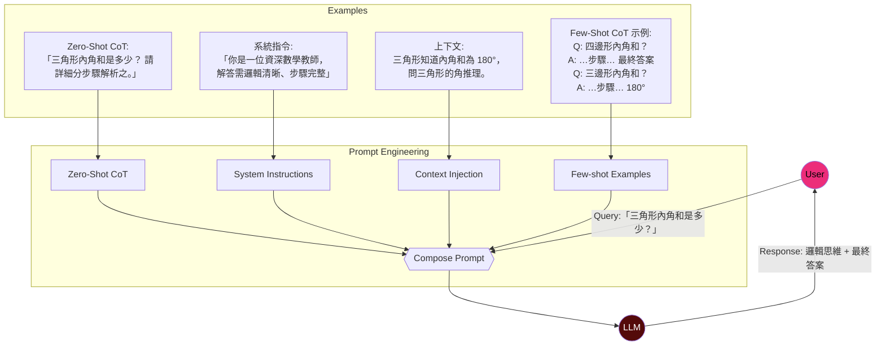
提示工程改善了用戶與 LLM 之間的交互：

    - 結構化輸入: 用戶學習如何構造更有效的提示詞
    - 中介層: 提示工程作為用戶和 LLM 之間的橋樑，引導模型產生更好的結果
    - 改進的輸出: 經過優化的提示詞，LLM 能產生更精確、一致的回應

### 範例:

    - [提示工程範例](https://github.com/daxiaguojin/daxiaguojin.github.io/blob/main/prompt_engineering.md)

---
      
## Token

### 時間：2020~

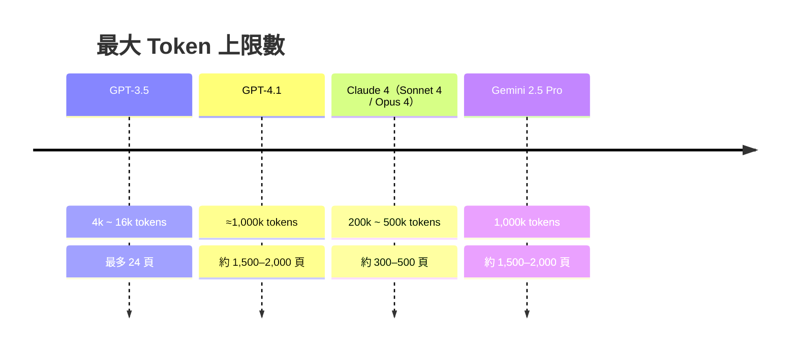

### 甚麼是Token？

token 是現代大型語言模型（LLM）處理文本的基本單位。它不是固定的「字」或「詞」，而是由模型 tokenizer 自動分割出具有意義的「字串」或「子詞單位」。

    - 英文中的 "unbelievable" 可能被斷成 ["un", "believ", "able"]，所以一個字可能是多個 token。
    - 中文通常每個字是一個 token，例如「測」、「試」、「中」分別為獨立 tokens。

### 對話的完整上下文包含：

    - 使用者的提問
    - 模型之前的回應
    - 系統訊息（如角色設定）
    - 你可能傳的文件、表格、指令等外部內容
    - 歷史對話記錄（多輪內容）
    - 模型之後的回應
    
### 當總 token 數超過限制時，模型會：

    - 裁切最早的歷史對話內容（通常是你最早的提問與模型的回覆）
    - 保留最近的幾輪對話 + 當前提問 + 系統訊息
    - 這會導致模型「忘記你先前說的話」，可能讓回答變得前後不一致。

---

## 檢索增強生成 Retrieval-Augmented Generation (RAG)

### 時間：2021~

### 發現的問題：

    - 訓練好的 LLM 雖然能生成自然語言，但知識是靜態的，無法即時查詢最新資訊或公司內部資料。
    - 如果訓練資料中缺少某些領域的知識，模型會給出錯誤答案或胡亂編造。

### 解決方案：RAG（Retrieval-Augmented Generation，檢索增強生成）

    - 原理：在 LLM 生成回應前，先從外部知識庫（如向量資料庫、企業內部文件）檢索相關資訊，並將這些資訊傳給 LLM 作為上下文來生成更準確的回應。

### 改進點：

    - 讓 LLM 可以即時訪問外部知識，減少幻覺。
    - 企業可以利用自己的資料（如技術文件、客服對話）來增強 LLM 的回答能力。

### 例子：

    - [RAG程式範例](https://github.com/daxiaguojin/daxiaguojin.github.io/blob/main/rag.md)

### 流程：
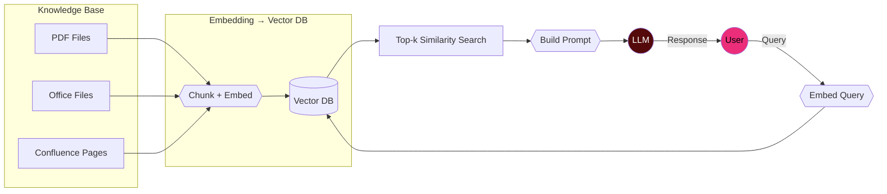

    - 原始文檔 (string) → 使用 tokenizer 統計 token 長度 → chunking (使用 token count 作為切分邊界 + overlap) → 每個 chunk 啟用 tokenizer → 生成真正的 token ID 列表 → 再 embed 做語意向量。
    - 而使用者的提問流程則是 Tokenizing (分詞) → Embedding (向量化)，最後再進行 retrieval 和 generation。

---

## 上下文學習 Context Learning

### 時間：2022~

### 發現的問題：

    - LLM 雖然具備廣泛知識，但缺乏對特定企業情境的理解。
    - 無法長期記憶先前對話，也無法處理大量文件（受限於 token 上限）。
  
    
### 解決方案：

    - 在 LLM 生成回應時，將相關資訊（例如使用者上傳的文件、對話上下文）一併作為 prompt 提供給模型參考，讓 LLM「彷彿」當下就學會這些資訊。

### 改進點：

    - 讓 LLM 在不需要重新訓練模型的情況下，也能理解特定情境或專案資料。
    - 適合中小型應用，或一次性處理文件（如合約審閱、報告摘要）。
    - 開發速度快、門檻低，是許多 Copilot 工具（如 Office、VS Code）常見的技術基礎。
    
### 流程：

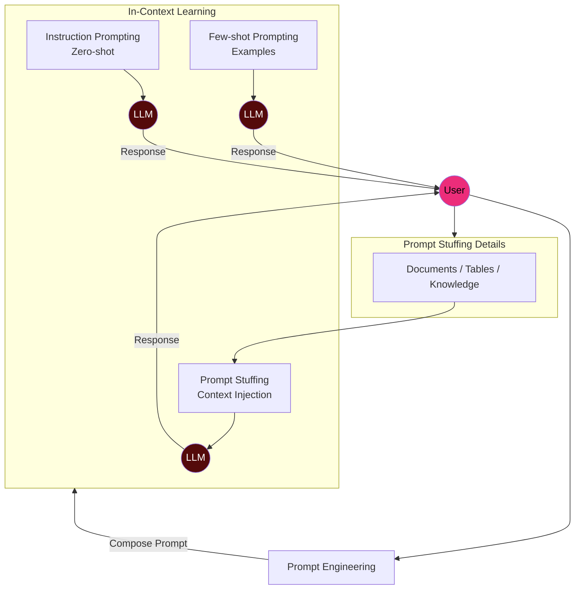

---

## 函數調用 Function Calling

### 時間：2023.06

### 發現的問題：

    - LLM 可以產生正確的建議（例如「你可以申請一張請購單」），但它無法執行具體的動作（如查詢某一張請購單進度，或將待簽核的表單填寫意見核准送出）。
    - 使用者仍然需要手動操作系統，降低了自動化效率。
    
    
### 解決方案：

    - OpenAI 於 2023 年 6 月 在其 API 中引入此功能，讓 LLM 可以根據需求輸出結構化數據（如 JSON），並透過 API 調用外部系統來執行具體任務。
    
### 流程：

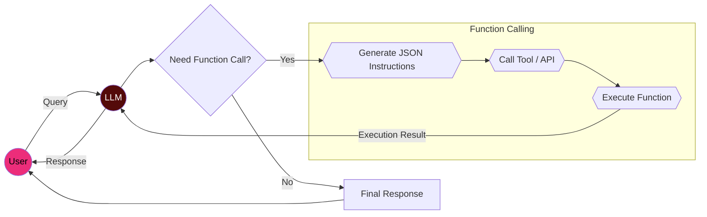
 
### 改進點：

    - 讓 LLM 可以即時訪問外部知識，減少幻覺。
    - 企業可以利用自己的資料（如儲存在關聯式資料庫的資料、客服對話）來增強 LLM 的回答能力。

---

## 智能代理 AI Agent

### 時間：2023-24

### 發現的問題：

    - Function Calling 讓 LLM 可以執行單個指令，但它無法自主計劃和執行複雜任務。例如：「幫我整理一份 IT 年度報告」涉及多個步驟（查詢數據 → 生成摘要 → 匯總成報告）。
Function Calling 只能處理單一 API 呼叫，無法自己決定「下一步該做什麼」。
    
### 解決方案：

    - 讓 LLM 不只是回答問題，而是根據目標「規劃步驟」、「決策下一步行動」並「執行多個函數」。在人工智慧領域，智能代理的概念早已存在，但結合 LLM 的 Agent 系統在 2023 年 開始受到廣泛關注。

### 範例：

    - [function calling範例](https://github.com/daxiaguojin/daxiaguojin.github.io/blob/main/function_calling.md)

### 流程：

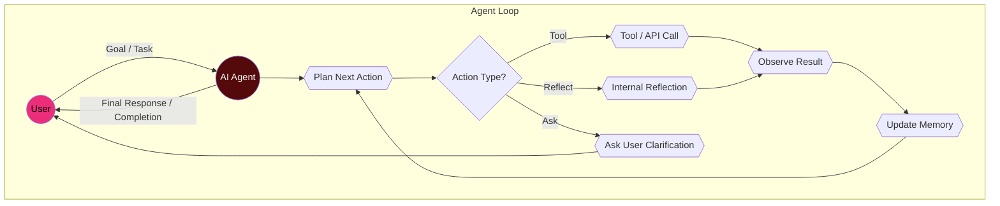
 
### 改進點：

    - 讓 AI 可以自主處理複雜任務，而不只是單次回應。
    - 可以與 Function Calling 和 RAG 結合，形成完整的智能工作流。

---

## 代理式檢索增強生成 Agentic RAG

### 時間：2024

### 技術特點：

    - 作為 RAG 的進化版本，Agentic RAG 在 2024 年 開始出現，結合 Agent 能力，使檢索與生成過程更加自主和靈活。
    
### 流程：

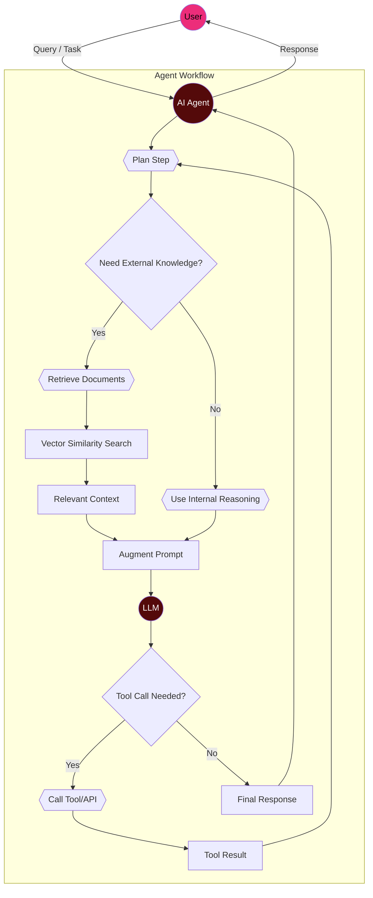
    
### 改進點：

    - 能夠動態調整檢索策略，自主決定何時檢索、檢索什麼內容，以及如何整合檢索到的資訊，提供更智能的知識增強生成能力。

---

## 模型上下文協議 Model Context Protocol (MCP)

### 時間：2024~25

### 發現的問題：

    - 在大型企業應用中，通常需要多個 AI 模型或和外部系統協作，例如：
        - 一個 RAG 系統負責檢索企業內部文件。
        - 一個 Function Calling 負責執行業務操作。
        - 一個 Agent 負責綜合決策並指導整個流程。
    
    - 這些 AI 模型和外部系統各自獨立，沒有標準化的方式來共享上下文資訊，導致資訊孤島。
    
### 解決方案：

    - 由 Anthropic 在 2024 年底推出的開放標準，它徹底改變了 AI 如何與「外部世界」互動的方式。你可以把它視為「AI 應用程式的 USB-C 接口」一種通用的連接方式，讓 AI 模型能安全、標準化地存取外部即時資料與工具。

### 範例：

    - [MCP程式範例](https://github.com/daxiaguojin/daxiaguojin.github.io/blob/main/mcp.md)

### 流程：
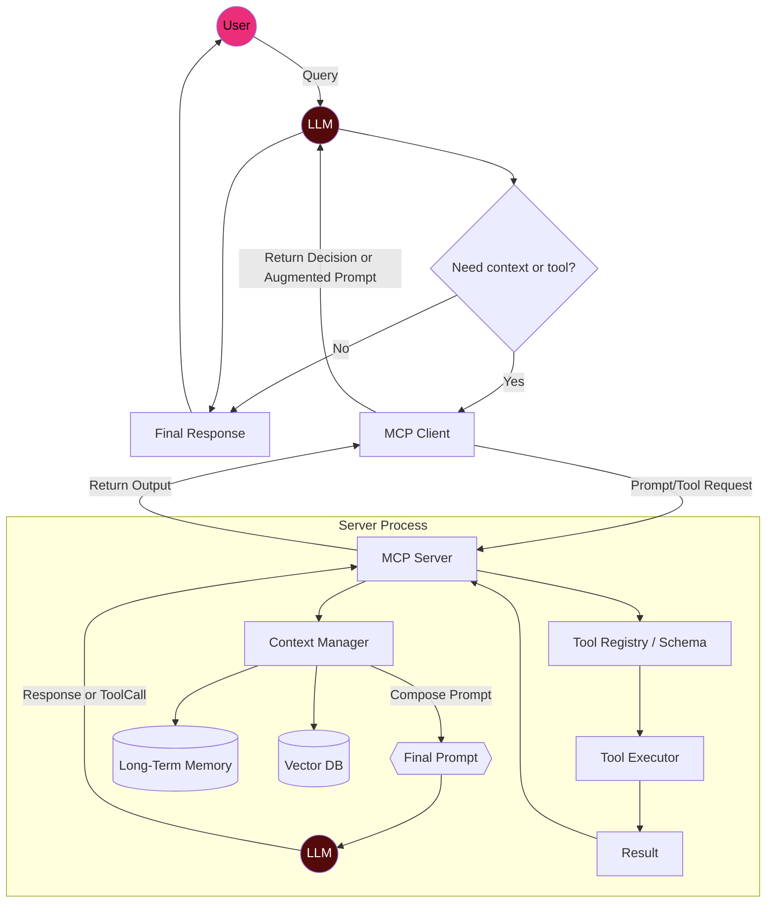
 
### 改進點：

    - 讓不同的 AI 模型互通，不再是獨立運行的「黑箱」。
    - 讓 AI 生態系統更加靈活，能夠跨系統處理更複雜的任務。

---

## 多代理系統 Multi-Agent System

### 時間：2024

### 技術特點: 

    - 多代理系統的概念早已有之，但在 AI 領域，結合 LLM 的多代理協作系統在 2024 年 開始被廣泛研究和應用。
    
### 應用方式: 

    - 多個AI代理分工合作，各司其職，協同解決複雜問題，展現集體智慧的力量。每個代理可以專精於不同的任務領域，通過協作完成單一代理無法處理的複雜工作。

---

## AI 輔助開發 AI‑Assisted Software Development

### 時間：2025

### 背景和問題： 
    
    - 隨著程式愈來愈複雜，開發者不僅要寫程式，還要 Debug、測試、維護 legacy code。
    
### 解決方案：

    - AI 如 VS Code (內建GitHub Copilot，或外掛Gemini Code Assist、Cline、Roo Code等)、Cursor、Windsurf、Trae等IDE工具，可在撰寫程式時自動補全 code、生成測試範例、偵錯建議、撰寫註解，提升效率並減少 bug。 
    - 這些AI工具也不限於需要使用IDE才能使用。包括Claude (Claude Code)、Google (Gemini)、Atlassian (Rovo Dev)、Amazon (Kiro)、Qwen等都已釋出在命令列可以執行的AI輔助開發工具。
    
### 例子：

    - 補全：你寫 for (int i=0; i&lt;10; i++)，AI 即刻建議整個迴圈內容。
    - 偵錯：AI 主動指出潛在 Null pointer，並標記風險行數。 

---

## 氛圍編程 Vibe Coding

### 時間：2025

### 技術特點: 

    - 這個概念源自 OpenAI 聯合創辦人 Andrej Karpathy，在 2025 年提出，用來描述一種「幾乎忘記程式碼存在，只用語意導引 AI 寫程式」的新開發方式 。
    - 它與「No‑code／Low‑code」不同，強調『自然語言 → AI 生成邏輯和介面』，開發者不需了解語法，只需透過描述讓 AI 完成大部分程式生成 。
    
### 技術特點: 

    - 建立在大型語言模型（如 GPT‑4、Claude、Gemini、DeepSeek、Qwen等）可理解並生成程式碼之能力。
    
### 應用方式: 

    - 幫助非程式背景者「自己作原型、小工具」。

---

## 規格先行 Vibe Spec

### 時間：2025

### 技術特點: 

    - Vibe Spec（或稱 Vibespec）是一種將自然語言與正式規格結合的方式，讓 LLM 在生成程式碼前，先產生一份清晰、可追蹤的規格文件。這有助於避免隨性生成導致的混亂與錯誤。
    
### 解決的問題：

    - Vibe Coding 雖快速流暢，但容易缺乏結構、可測試性，並帶來安全與維護風險。
    - Vibe Spec 可以為每個功能定義需求、輸入/輸出、流程與測試標準，讓 AI 輸出的程式碼更穩健且可複製。
    
    
### 例子：

    - 工具層級：在絕大多數的AI輔助開發工具中，你都可以設定規則或透過提示詞讓 AI 在開始寫程式前，自動先生成 spec，而不是直接生成程式碼。
    - 實務流程：使用三份 Markdown 文件（requirements.md、design.md、tasks.md）來描述使用者故事、架構設計與任務拆解，類似 Kiro Spec 的開發流程，確保 AI 按 spec 編碼。
    - agent.md: [agent.md](https://github.com/daxiaguojin/daxiaguojin.github.io/blob/main/agent.md)

### 流程：

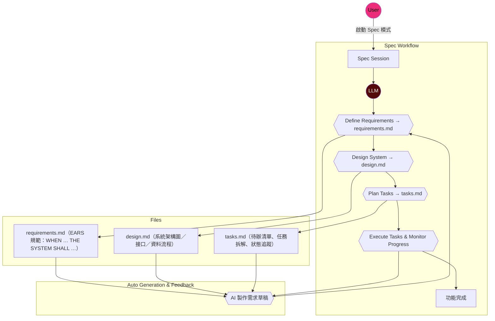

---

## 多模態人工智能 Multimodal AI

### 時間：2023~2025

### 背景和問題：

    - 單純文本或圖像的思維限制創意與應用場景。
    
### 解決方案：

    - 多模態模型能處理文字／圖片／語音／影音，讓應用更貼近複雜需求。 
    
### 例子：

    - 客服 AI 能根據客戶上傳的故障照片，分析問題並語音回覆操作步驟。
    - 企劃中 AI 幫你根據腳本直接生成簡短動畫提案片段。

---

## 合成式多媒體 Synthetic Media

### 時間：2023~2025

### 背景和問題：

    - 傳統影像、音頻內容製作耗時高、人力密集。
    
### 解決方案：

    - GenAI可自動生成圖像、音樂、影片、甚至互動遊戲元素。 
    
### 例子：

    - 藝術家用 AI 生成獨特的數位藝術作品。如 Midjourney、DALL·E 3、Stable Diffusion、Adobe Firefly。使用者輸入文字描述生成圖像，可生成多風格藝術作品，並可進行風格融合與構圖微調。
        - "A serene Chinese mountain landscape, ink wash style, misty valleys, flowing river, ancient pavilions, high detail, 8K"
        - "Cyberpunk city at night, neon lights, rain reflections, flying cars, ultra-realistic, cinematic lighting"
    - 影片製作者用 AI 生成動畫角色和背景。如Runway ML、Pika Labs、Synthesia、Kaiber。使用者輸入文字生成影片或動畫，部分工具支援影片擴展（video inpainting）與影片風格轉換。
        - "Fantasy forest with glowing mushrooms and floating islands, magical atmosphere, Studio Ghibli style"
        - "Slow motion cinematic showcase of a futuristic smartphone, rotating on a pedestal, holographic UI effects"
    - 音樂人用 AI 生成背景音樂或聲效。如Suno AI、AIVA、Soundraw、Boomy、ElevenLabs（語音）。使用者輸入文字或上傳旋律片段生成完整音樂，支援多種音樂風格與音效設計。
        - "Relaxing ambient background music with piano, soft strings, and nature sounds, loopable, 3 minutes"
        - "Short sci-fi door opening sound, mechanical with soft pneumatic hiss"

---

## 生成設計 Generative Design

### 時間：2025

### 背景和問題： 

工程或建築設計需考慮節能、成本、材質等複雜參數。
    
### 解決方案： 

    - AI 把 CAD + 環境數據導入，經由演算法生成多種設計方案供選擇。 
    
### 例子：

    - 建築師需求：只描述「需要最大自然採光、用最低成本建一棟辦公室」，AI 畫出 5 種外觀與材料配置供選擇。
    - IT 機櫃規劃：規劃機櫃配置時，AI 根據冷度流量與電力負載給出合理排佈建議。
    - PTC的Creo：工程師可以透過互動方式指定各自的需求與目標，包括偏好的材料與製造流程，而生成式設計引擎就會自動產生可立即生產的設計，以便當做繼續設計的起點或最終版本的解決方案。因此工程師可以與技術互動，更快建立卓越的設計並推動產品創新。

---

## 因果人工智慧 Causal AI

### 時間：2025

### 背景和問題： 

    - GenAI背後的大型語言模型雖然可以用類似人類對話的方式回答問題，甚至創建連貫且富有創意的文字，但 LLM 的回答內容事實上是以統計學上最有可能出現的字詞，而非像是人類在思考般以「因果」進行推論的。
    - 世界經濟論壇報導提出，將「因果AI」與生成式AI 結合，將能輔助生成式AI 提升決策解釋力、減少偏差與風險。
    
### 解決方案： 

    - 因果 AI 建立「X 導致 Y」模型，幫企業做更可靠的決策 
    
### 例子：

    - IT 評估系統升級是否導致效能下降，就能區分「版本不穩定導致的問題」vs.「正確升級帶來的延遲」。
    - 客服部門可找出「培訓完客服是否真正改善滿意度」，而不是只看時間關聯。

---

## 微調 Fine-Tuning

### 時間：2022

### 背景和問題：

* 大型語言模型（LLM）雖然具備強大的語言理解與生成能力，但在特定領域或專業任務上，常因知識不足或風格不符而產生不精確或偏離需求的回答。
* 單純依靠 Prompt Engineering 難以完全克服這些限制，尤其是需要模型使用特定術語、固定格式或遵循企業規範時。
* 部分產業（如醫療、法律、金融）需要模型融入專業資料與行業知識，才能符合合規與精準要求。

### 解決方案：

* **Fine-Tuning** 是在現有預訓練 LLM 基礎上，利用特定領域或任務的標註資料進行再訓練，讓模型更契合目標用途。
* 能使模型在生成內容時，遵循特定語氣、結構與知識範圍，減少錯誤與偏離。
* 可用於分類、結構化輸出、長期風格一致性等任務，比單純調 Prompt 更穩定。

### 例子：

* **客服問答系統**：以公司 FAQ 與歷史客服對話紀錄微調模型，使其回覆更貼近品牌語氣與內部知識。
* **法律文件生成**：針對合約模板與法規條文進行微調，讓模型自動生成符合法律格式與用詞的草稿。
* **醫療診斷建議**：用經過專業審核的病歷與診斷資料微調模型，輔助醫師提供符合臨床指南的初步建議。

### 流程：

- 準備資料集 → 收集與任務相關的高品質資料，例如 FAQ、合約、醫療紀錄等。
- 資料清理與格式化 → 去除錯誤、不一致的內容，並轉換成模型可接受的 JSONL、CSV 或其他格式。
- 劃分資料集 → 按比例分為 訓練集（Training Set） 與 驗證集（Validation Set），確保能在訓練中評估效果。
- 選擇基礎模型 → 根據需求選擇 GPT-3.5、LLaMA、Mistral 等作為微調基礎。
- 開始微調訓練 → 使用 Fine-Tuning API 或框架（如 Hugging Face Trainer）對模型再訓練。
- 監控與驗證 → 在驗證集上測試，確保模型的準確率、格式一致性與風格達標。
- 儲存微調後模型 → 保存成可部署的模型權重與設定檔。
- 部署至應用系統 → 上線到聊天機器人、API、文件生成系統等。
- 持續監控與再訓練 → 收集新資料，週期性更新模型，保持效果最佳化。

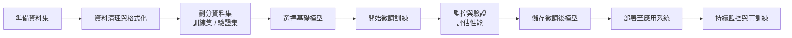

---
  

## 此時此刻，AI的演進還在繼續中...(未完待續)

---

## 問題1

### 要怎麼讓已整合RAG技術的GenAI只回答搜尋到的文件內容，而不會亂說話？
---

## 問題2

### 在剛剛講述的應用技術中，用那一種技術可以來查詢BPM資料庫中的資訊？
---

## 問題3

### AI輔助開發工具用了那些我們剛剛講述的應用技術？
---

## 問題4
    
### 那些應用技術是可以來解決GenAI產生幻覺？
---

## 問題5

### ChatGPT聊天介面上可以開啟的網頁搜尋功能，你覺得是使用哪一種應用技術達成？
---

## 問題6

### 要讓GenAI能夠回答GeDCC上關於ISO 27001管理規範的問題，可以使用那種技術來達成？
---

## 問題7
    
### 要讓 GenAI 自動執行一連串任務，例如收集資料 → 整理摘要 → 寄出報告，應該用哪一種技術？
---

## 問題8

### 如果我們希望不同 AI 模型（像查資料的 vs 處理數據的）能協作工作，該使用哪種技術？
---

## 問題9

### 如果一位非工程背景的同仁，用自然語言就可以完成一個小工具，你覺得是用到哪個技術？
---

## 問題10

### Business Analyst或Project Manager們可以怎麼來使用這些GenAI技術？
